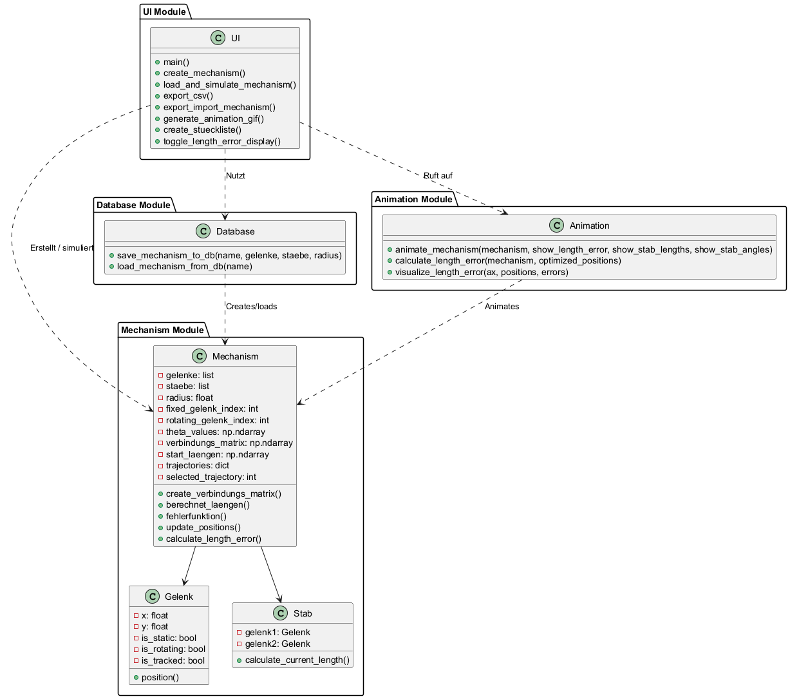

# SWD_Abschlussprojekt

## Installation

1. **Python installieren**  
  Stelle sicher, dass Python 3.x auf deinem System installiert ist. Du kannst Python von [python.org](https://www.python.org/downloads/) herunterladen.

2. **Virtuelle Umgebung erstellen**  
  Es wird empfohlen, eine virtuelle Umgebung zu verwenden, um Abhängigkeiten zu isolieren. Erstelle eine virtuelle Umgebung mit dem folgenden Befehl:
  ```bash
  python -m venv venv
  ```

3. **Virtuelle Umgebung aktivieren**  
  - Auf Windows:
    ```bash
    .\venv\Scripts\activate
    ```
  - Auf macOS/Linux:
    ```bash
    source venv/bin/activate
    ```

4. **Abhängigkeiten installieren**  
  Installiere die benötigten Pakete mit `pip`:
  ```bash
  pip install -r requirements.txt
  ```

## Ausführung

1. **Streamlit-Anwendung starten**  
  Führe den folgenden Befehl aus, um die interaktive Mechanismus-Simulation zu starten:
  ```bash
  streamlit run ui.py
  ```
  Oder verwende die Webanwendung: https://best-mechanism-simulator.streamlit.app/

2. **Mechanismus erstellen**  
  - Öffne die Anwendung im Browser.
  - Gehe zum Tab "Erstellen".
  - Wähle den Rotationsradius und die Anzahl der Gelenkpunkte.
  - Bearbeite die Gelenkpunkte und Stäbe nach Bedarf.
  - Gib einen Namen für den Mechanismus ein und klicke auf "Speichern".

3. **Mechanismus laden und simulieren**  
  - Wechsle zum Tab "Laden".
  - Wähle einen gespeicherten Mechanismus aus der Dropdown-Liste und klicke auf "Laden".
  - Klicke auf "Mechanik ausführen", um die Simulation zu starten.

4. **CSV exportieren**  
  - Gehe zum Tab "CSV download".
  - Wähle einen gespeicherten Mechanismus aus der Dropdown-Liste und klicke auf "Laden".
  - Entscheide, ob die CSV-Datei nur für die ausgewählte Trajektorie exportiert werden soll.
  - Klicke auf "CSV exportieren", um die Daten herunterzuladen.

5. **Mechanismus exportieren/importieren**  
  - Navigiere zum Tab "Export/Import".
  - Wähle einen gespeicherten Mechanismus aus der Dropdown-Liste und klicke auf "JSON herunterladen", um den Mechanismus als JSON-Datei zu exportieren.
  - Lade eine JSON-Datei hoch, um einen Mechanismus zu importieren.

6. **Mechanismusanimation (GIF) downloaden**  
  - Öffne den Tab "GIF".
  - Wähle einen gespeicherten Mechanismus aus der Dropdown-Liste und klicke auf "Laden".
  - Wähle die Anzeigeoptionen (Längenfehler, Stablängen, Stabwinkel).
  - Klicke auf "Download als GIF", um die Animation herunterzuladen.

7. **Stückliste erstellen**  
  - Gehe zum Tab "Stückliste".
  - Wähle die Gelenke, Stäbe und Antriebe aus, die in die Stückliste aufgenommen werden sollen.
  - Klicke auf "Stückliste als CSV herunterladen", um die Liste zu exportieren.

## Projektstruktur

- **database.py**: Funktionen zum Speichern und Laden von Mechanismen in der Datenbank.
- **mechanism.py**: Enthält Klassen und Funktionen zur Definition und Simulation von Mechanismen.
- **animation.py**: Funktionen zur Animation der Mechanismen.
- **mechanism_db.json**: Datenbankdatei für gespeicherte Mechanismen.
- **requirements.txt**: Liste der benötigten Python-Pakete.
- **README.md**: Diese Dokumentation.

## Abhängigkeiten

Die benötigten Pakete sind in der Datei `requirements.txt` aufgeführt. Zu den wichtigsten Paketen gehören:
- streamlit
- numpy
- pandas
- matplotlib
- tinydb
- scipy

# Projektdokumentation

Im Projekt wurden alle geforderten Minimalanforderungen umgesetzt. Darüber hinaus würden auch noch zusätzliche Features implementiert. Hier werden die im Rahmen des Projekts umgesetzten Erweiterungen dokumentiert:

## Simulierung des "Strandbeast" Mechanismus
Eingehen wurde außerdem die Fähigkeit der Software getestet. Durch die implementierung des "Strandbeast" Mechanismus. Hierbei wurde durch Testen und Internetrecherche die Gelenkkoordinaten bestimmt und in die Software eingetragen. Anschließend dann auch simuliert siehe in dieser GIF: 
Das Ergebnis entspricht noch nicht ganz der optimalen Trajektorie. Der Mechanismus läuft aber schonmal in einer etwa gleicher Weise. 
## Erweiterung 1: Darstellung der Längenfehler

**Beschreibung**  
Zeigt den prozentualen Längenfehler der einzelnen Verbindungen (Stäbe) in Abhängigkeit vom Winkel Phi (θ) an. Der Fehler wird als Differenz zwischen den optimierten Stablängen und den Ausgangslängen (`start_laengen`) berechnet und direkt in der Animation angezeigt.

**Umsetzungsschritte**

1. **Berechnung der Startlängen**  
  - In der Methode `berechnet_laengen()` der Klasse `Mechanism` (in mechanism.py) wird die ursprüngliche Länge jedes Stabes ermittelt und in `self.start_laengen` gespeichert.

2. **Erweiterung der Animation**  
  - Die Funktion `animate_mechanism()` in animation.py nutzt die neue Hilfsfunktion `calculate_length_error`, die die aktuellen Stablängen berechnet und den prozentualen Fehler ermittelt.  
  - Bei aktivierter Option „Prozentualen Längenfehler anzeigen“ werden die Fehlerwerte als Textannotationen über den entsprechenden Stäben eingeblendet.

3. **Integration in die Benutzeroberfläche**  
  - In `ui.py` wurde ein Toggle-Button für die Anzeige des Längenfehlers integriert, der in verschiedenen Tabs (Erstellung, Laden/Darstellung, Animation etc.) verfügbar ist.

**Resultate und Vorteile**

- Direkter visueller Einblick in die Genauigkeit der mechanischen Berechnungen.
- Unterstützung bei der Fehlersuche und Optimierung.
- Validierung des Modells durch Offenlegung der Abweichungen.
- Interaktive Analyse durch unterschiedliche Einstellungen.

## Erweiterung 2: Animation als Video/GIF

### Beschreibung  
Ermöglicht den Export der Mechanismus-Simulation als animiertes GIF. Die in der interaktiven Ansicht erzeugte Animation wird unter Berücksichtigung der gewählten Anzeigeoptionen (z. B. Längenfehler) in eine GIF-Datei gerendert.

### Umsetzungsschritte

1. **UI-Integration (Tab [4])**  
  - Ein neuer Tab für den GIF-Export wurde in die Benutzeroberfläche integriert.
  - Auswahl eines gespeicherten Mechanismus sowie Aktivierung von Anzeigeoptionen (z. B. Längenfehler, Stablängen, Winkel).

2. **Animation erstellen**  
  - Die Funktion `animate_mechanism()` in animation.py erstellt die Animation basierend auf den Mechanismus-Daten und überträgt alle UI-Einstellungen in die Animation.

3. **GIF-Export**  
  - Die Animation wird mit `PillowWriter` als GIF mit 10 fps exportiert.
  - Ein Download-Button stellt die resultierende Datei in der Benutzeroberfläche bereit.

### Resultate und Vorteile

- Exportierbare Animationen für Berichte oder Präsentationen.
- Intuitive Handhabung durch Integration in die Benutzeroberfläche.
- Exakte Wiedergabe der interaktiven Ansicht.

## Erweiterung 3: Overlay von Winkeln und/oder Längen

**Beschreibung**  
Ermöglicht das Einblenden dynamischer Overlays in der Simulation, die entweder die aktuellen Stablängen oder die Winkel zwischen den Stäben anzeigen.

**Umsetzungsschritte**

- **Messwert-Ermittlung:**  
  - In animation.py werden die Funktionen `calculate_stab_lengths(positions, staebe)` und `calculate_stab_angles(positions, staebe)` genutzt, um die aktuellen Längen und Winkel zu berechnen.
  
- **Integration in die Animation:**  
  - Im `update()`-Callback der Funktion `animate_mechanism()` werden, je nach aktivierten Optionen, Textannotationen eingeblendet:
   - **Stablängen:** Zeigt den aktuellen Längenwert in blauer Schrift über jedem Stab.
   - **Winkel:** Zeigt die berechneten Winkel in grüner Schrift in der Nähe der Gelenke.

- **Benutzeroberfläche (UI):**  
  - In `ui.py` wurden Toggle-Buttons hinzugefügt, mit denen Benutzer festlegen können, ob die Overlays für Längen, Winkel oder beides angezeigt werden sollen.

**Resultate und Vorteile**

- Unmittelbare visuelle Rückmeldung durch quantitative Informationen.
- Unterstützung bei der präzisen Analyse und Validierung der Simulation.
- Flexible Anpassung der Anzeigeoptionen über die Benutzeroberfläche.

## Erweiterung 4: Anfertigung einer Stückliste für ausgewählte Gestänge, Antriebe und Gelenke

**Beschreibung**  
Mit dieser Erweiterung können Anwender eine Stückliste aus dem derzeit geladenen Mechanismus generieren. Es ist möglich, die Komponenten auszuwählen, die in die Stückliste aufgenommen werden sollen – speziell Gelenke, Stäbe (Gestänge) und Antriebe. Die angefertigte Stückliste wird in Form einer Tabelle präsentiert und ist als CSV-Datei exportierbar.

**Umsetzungsschritte**

- **Benutzeroberfläche:**  
  - In `ui.py` wurde ein neuer Tab mit dem Titel „Stückliste erstellen“ hinzugefügt.
  - Anwender können über Multiselect-Felder:
   - Gelenke aussuchen
   - Stäbe (Gestänge) aussuchen
   - Antriebe (d.h. rotierende Gelenke) aussuchen

- **Erstellung der Stückliste:**  
  Nach der Auswahl der gewünschten Komponenten wird eine Stückliste erstellt, die für jeden Eintrag den Typ (z. B. „Gelenk“, „Stab“, „Antrieb“) sowie den Namen (z. B. „G0“, „S1“, „A2“) auflistet.

- **Export-Funktion:**  
  Die Stückliste wird mit der Pandas-Bibliothek in das CSV-Format konvertiert. Die CSV-Datei kann dann über einen Download-Button direkt aus der Anwendung heruntergeladen werden.

**Resultate und Vorteile**

- Gezielte Auswahl: Nur die Komponenten, die für die weitere Analyse oder Dokumentation relevant sind, werden in die Stückliste aufgenommen.
- Effiziente Weiterverarbeitung: Die Stückliste kann durch den Export als CSV-Datei leicht in andere Anwendungen importiert und weiterverarbeitet werden, etwa für Kalkulationen oder Berichte.
- Interaktive Handhabung: Dank der Einbindung in die Benutzeroberfläche ist sofort ersichtlich, welche Komponenten gewählt wurden und wie die resultierende Stückliste aussieht.

## Erweiterung 5: Festlegung einer Auszeichnungssprache für Mechanik-Modelle (Import/Export)

**Darstellung**  
Im Zuge dieser Erweiterung wurde eine spezielle Auszeichnungssprache im JSON-Format entwickelt, um Mechanismen strukturiert darzustellen. So können die Modelle vollständig exportiert und bei Bedarf in einer anderen Umgebung oder zu einem späteren Zeitpunkt wieder importiert werden. Anwender können Mechanik-Modelle so unkompliziert austauschen, archivieren und wiederverwenden.

**Schritte der Realisierung**

- **Struktur der Markup-Sprache:**  
  - Die Daten der Mechanismen werden in einem übergeordneten Objekt namens "mechanisms" im JSON-Format gespeichert.
  - Jeder Mechanismus wird mit einer eindeutigen Kennung (z. B. „1“) versehen und enthält folgende Informationen:
   - Name des Mechanismus
   - Gelenke (als Array von Objekten, die x- und y-Koordinaten sowie boolesche Flags für fixierte, rotierende und getrackte Gelenke enthalten)
   - Stäbe (als Array von Referenzen auf die Gelenke, die sie verbinden)
   - Radius (Rotationsradius)

  **Beispielausschnitt im JSON-Format:**
  ```json
  {
   "mechanisms": {
    "1": {
      "name": "Beispiel-Mechanismus",
      "gelenke": [
       { "x": 0, "y": 0, "static": true, "rotating": false, "tracked": false },
       { "x": 10, "y": 10, "static": false, "rotating": true, "tracked": false }
      ],
      "staebe": [
       [0, 1]
      ],
      "radius": 10
    }
   }
  }
  ```

**Exportfeature**

Im Benutzerinterface (siehe `ui.py`) gibt es einen Tab „Mechanik-Export/Import“. Über diesen kann ein gespeicherter Mechanismus ausgewählt und als JSON-Datei heruntergeladen werden. Alle relevanten Mechanismusdaten (Gelenke, Stäbe, Rotationsradius) werden in das angegebene JSON-Format gespeichert.

**Import-Feature**

Im gleichen Tab kann eine JSON-Datei hochgeladen werden, um einen Mechanismus zu importieren. Beim Einlesen wird der JSON-Inhalt analysiert, und die Gelenke, Stäbe sowie der Rotationsradius werden automatisch rekonstruiert, sodass der Mechanismus sofort in der Anwendung verwendet werden kann.

**Resultate und Vorteil**
 - Plattformunabhängigkeit: Das JSON-Format ermöglicht einen einfachen Austausch von Mechanismen   zwischen verschiedenen Systemen oder Anwendungen.
 - Nachhaltige Archivierung: Mechanik-Modelle lassen sich als Datei speichern und später unverändert wiederverwenden.
 - Einfache Erweiterbarkeit: Die Auszeichnungssprache kann bei Bedarf um zusätzliche Felder (z. B. Materialeigenschaften oder Metadaten) ergänzt werden, ohne dass das Grundgerüst verändert wird.

 Erweiterung 6: Kalkulation der höchsten Vorwärtsgeschwindigkeit Beschreibung Im Rahmen dieser Erweiterung wird eine neue Kennzahl eingeführt, mit deren Hilfe die maximale Vorwärtsgeschwindigkeit eines definierten Punktes (z. B. eines Fußpunktes) in einem Strandbeest-Mechanismus berechnet werden kann. Die Geschwindigkeit wird basierend auf der Drehgeschwindigkeit der Kurbel, der Schrittlänge und der maximalen Schritthöhe berechnet. So ergibt sich ein Optimierungskriterium für die Feinjustierung der Gliederlängen, das eine effizientere Fortbewegung ermöglicht.

Umsetzungsmaßnahmen Erfassung der Zielpunkt-Trajektorie:

Im Verlauf der Simulation wird die Bewegung eines ausgewählten Punktes (zum Beispiel des Fußes) fortlaufend dokumentiert.
Der in X-Richtung erfolgende Fortschritt wird anhand der in der Simulation erzeugten Trajektorie (X- und Y-Koordinaten) bestimmt.
Ermittlung der Vorwärtsgeschwindigkeit:

Die Differenz zwischen dem maximalen und minimalen X-Wert, der innerhalb einer vollen Kurbelumdrehung erreicht wurde, wird berechnet.
Die effektive Vorwärtsgeschwindigkeit wird unter Berücksichtigung der Drehgeschwindigkeit der Kurbel (die in der Simulation eingestellt werden kann) bestimmt.
Die Berechnung berücksichtigt zudem die Schrittlänge (die horizontale Distanz eines vollständigen Schrittes) sowie die maximale Schritthöhe (ein Maß für die Effizienz der Schrittbewegung).
Einbindung in den Optimierungsprozess:

Die als Ergebnis der Berechnung erhaltene Vorwärtsgeschwindigkeit wird als Maßstab zur Optimierung der Längen der Mechanismusglieder verwendet.
Der Mechanismus kann so optimiert werden, dass die maximale Vorwärtsgeschwindigkeit erreicht wird, indem die Längen schrittweise angepasst werden. 
Resultate und Vorteil
Quantitative Bewertung: Die Erweiterung bietet einen konkreten numerischen Wert oder eine grafische Darstellung der maximalen Vorwärtsgeschwindigkeit, die als Maßstab für die Leistung dient.

Optimierungsziel: Mit Hilfe der Metrik können die Parameter (Gliederlängen, Drehgeschwindigkeit, Schrittlänge, Schritthöhe) systematisch angepasst werden, um eine optimale Fortbewegungsleistung zu erzielen.

Gebrauch in der Simulation: Die Benutzer haben die Möglichkeit, die Folgen von Anpassungen der Parameter unmittelbar in der Simulation zu verfolgen. So können sie gut begründete Entscheidungen treffen, um den Mechanismus zu optimieren.

# Softwarestruktur
Weitere Details zur Softwarestruktur und den Komponenten, die in diesem Prozess miteinander interagieren, sind im UML-Diagramm im Repository dokumentiert 

# Verwendete Quellen
- https://discuss.streamlit.io/t/matplotlib-animation-funcanimation-support/8949
- https://de.wikipedia.org/wiki/Strandbeest#/media/Datei:Strandbeest_Leg_Proportions.svg
- https://www.geogebra.org/m/xdnnbGZG 